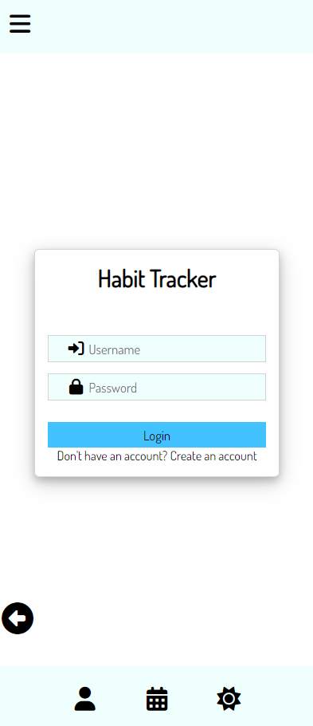

# Client Side

This is the client side repository of a habit tracker website.The server side repository of this website can be found [here](https://github.com/LAP2GroupProject/server-side). The server side repository is responsible taking in user's habit inputs whilst this client side repository is responsible for interacting with the server side to display such user inputs upon request. Users are able to register and/or log in to the website. After, they will be able to select various tasks they want to undertake, the amount of times they want to do it & document whether they complete it. The more habits they complete in a row, the greater their streak that gets stored.

## Installation & usage

### Installation

- Use **_git clone_** to clone the repository.
- Use **_git init_** to get the most update version of the repository.
- Download the repository at the top of this GitHub page.
- Use **_git pull_** to get the most update version of the repository once inside a terminal.

### Usage

1. Open project in a code editor.
1. Navigate into the client folder.
1. Open index.html file with live server.
1. Project will run in browser.

## Changelog

### index.html

- [Link to index.html](./index.html)

- Uses css style sheets & javascript files attached.

## Bugs

- All pages can still be accessed regardless of login/register status.
- All habits & streaks are shown on the [user_habit.html](./pages/user_habit.html) page instead of it being unique to the current user.

## Wins & Challenges

### Wins

- Fetch requests successfully made from the server side to the client side.
- Users can complete forms sot stroy their habits.

### Challenges

- Preventing access to pages from who are not logged in.
- Getting user's specific accounts by their id.

## Wireframes/Screenshots/Images

- Login & Register:
  

- All remaining:
  

- Login:
  

- Register:
  

- Overview of habits:
  

- Checklist:
  

- Habit options:
  

- Habit options Example:
  

- Successful Habit Submit:
  
